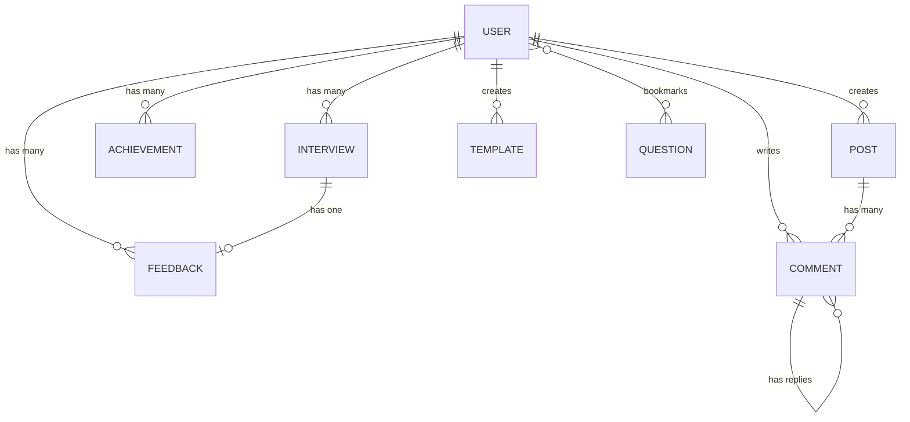

# 🎯 PrepWise — Interview Preparation Document

> **Context**: This document covers the complete PrepWise project — an AI-powered mock interview platform. Use it to prepare for in-depth technical questions about the project's architecture, design decisions, and implementation details.

---

## 1. Project Overview

**PrepWise** is a **real-time AI voice-powered mock interview platform** designed for college students and freshers. It simulates a Zoom-like interview experience where an AI interviewer **speaks, listens, and adapts** in real-time, then delivers detailed post-interview feedback with actionable insights.

### Problem It Solves
- College students lack access to realistic interview practice
- Traditional mock interviews are expensive, hard to schedule, and not scalable
- No existing platform offers real-time voice-based AI interviews with adaptive questioning and comprehensive feedback

### Key Differentiators
- **Voice-first experience** — not text-based chatbots, but a real spoken conversation
- **Adaptive AI** — the interviewer adjusts difficulty, follows up on vague answers, and manages time naturally
- **Zero-cost STT/TTS** — browser-native Speech Recognition + Speech Synthesis (no paid APIs for desktop)
- **Comprehensive feedback** — per-question analysis, category scores, radar charts, and downloadable PDF reports

---

## 2. High-Level Architecture

```
┌────────────────────────────────────────────────────────────┐
│                        CLIENT (React + Vite)               │
│  ┌───────────┐  ┌──────────────┐  ┌─────────────────────┐ │
│  │ Zustand    │  │ React Router │  │ Pages               │ │
│  │ Stores     │  │ (Lazy Load)  │  │ (15 route pages)    │ │
│  └─────┬─────┘  └──────────────┘  └─────────────────────┘ │
│        │                                                    │
│  ┌─────▼─────┐  ┌──────────────┐  ┌─────────────────────┐ │
│  │ Axios API │  │ Socket.IO    │  │ Web Speech API      │ │
│  │ Service   │  │ Client       │  │ (STT + TTS)         │ │
│  └─────┬─────┘  └──────┬───────┘  └─────────────────────┘ │
└────────┼────────────────┼──────────────────────────────────┘
         │   REST (HTTP)  │  WebSocket (bidirectional)
         ▼                ▼
┌────────────────────────────────────────────────────────────┐
│                    SERVER (Express 5 + Node.js)            │
│  ┌───────────┐  ┌──────────────┐  ┌─────────────────────┐ │
│  │ REST API  │  │ Socket.IO    │  │ Groq AI Service     │ │
│  │ Routes &  │  │ Server       │  │ (Llama 3.3 70B)     │ │
│  │ Controllers│ │ (Interview   │  │ - Question Gen      │ │
│  │           │  │  Handler)    │  │ - Feedback Gen      │ │
│  └─────┬─────┘  └──────┬───────┘  └─────────────────────┘ │
│        │                │                                   │
│  ┌─────▼────────────────▼──────────────────────────────────┐│
│  │              MongoDB (Mongoose ODM)                      ││
│  │  User | Interview | Feedback | Question | Post | etc.   ││
│  └─────────────────────────────────────────────────────────┘│
└────────────────────────────────────────────────────────────┘
```

### Communication Patterns
| Pattern | Protocol | Use Case |
|---------|----------|----------|
| REST API | HTTP (Axios) | Auth, CRUD, analytics, leaderboard, community |
| WebSocket | Socket.IO | Real-time interview session (turn-based AI conversation) |
| Browser API | Web Speech API | Speech-to-text (STT) and text-to-speech (TTS) |
| External API | HTTPS | Groq cloud inference (Llama 3.3 70B model) |

---

## 3. Tech Stack & Rationale

### Frontend

| Technology | Version | Why This Choice |
|-----------|---------|-----------------|
| **React 19** | 19.2 | Latest React with improved rendering, used with `lazy()` + `Suspense` for code splitting |
| **Vite** | 7.3 | Blazing-fast HMR and build times vs. CRA/Webpack; native ESM support |
| **Tailwind CSS v4** | 4.1 | Utility-first CSS for rapid UI development; v4 uses `@tailwindcss/vite` plugin (zero-config) |
| **Zustand** | 5.0 | Lightweight state management (~1KB); simpler than Redux — no boilerplate, no providers, no reducers |
| **Socket.IO Client** | 4.8 | Reliable WebSocket client with automatic fallback to polling, reconnection, and auth support |
| **Recharts** | 3.7 | Declarative chart library built on D3; integrates naturally with React components |
| **Framer Motion** | 12.34 | Production-grade animation library; used for orb animations, page transitions, micro-interactions |
| **React Router v7** | 7.13 | Client-side routing with nested routes, `Navigate` component, and lazy loading support |
| **jsPDF** | 4.1 | Client-side PDF generation for downloadable feedback reports |
| **Axios** | 1.13 | HTTP client with interceptors for JWT auth token injection and 401 auto-redirect |

### Backend

| Technology | Version | Why This Choice |
|-----------|---------|-----------------|
| **Node.js + Express 5** | 5.2 | Express 5 has async middleware error handling (no need for try-catch wrappers for async `next(error)`) |
| **MongoDB + Mongoose 9** | 9.2 | Document-based DB is ideal for semi-structured data (interview configs, transcripts, feedback JSON); schema flexibility for rapid iteration |
| **Socket.IO** | 4.8 | Bidirectional real-time communication; key for turn-based interview flow; handles reconnection, rooms, auth middleware |
| **Groq SDK** | 0.37 | Ultra-fast LLM inference (~10x faster than OpenAI); uses Llama 3.3 70B model; free tier available |
| **JWT + bcryptjs** | — | Stateless auth (no session store needed); bcrypt with 12 salt rounds for password hashing |
| **Morgan** | 1.10 | HTTP request logging for debugging in development |

### Why Socket.IO (Not REST or WebSocket)

> [!IMPORTANT]
> This is a frequently asked interview question.

**Socket.IO was chosen over raw WebSocket or REST polling because:**

1. **Turn-based real-time flow**: The interview follows a strict turn-based pattern (AI speaks → user speaks → AI responds). Each turn involves multiple events (`ai-thinking`, `ai-speaking`, `your-turn`, `time-update`). REST would require constant polling; raw WS lacks event naming.

2. **Automatic fallback**: Socket.IO falls back to HTTP long-polling if WebSocket is blocked by firewalls/proxies. This is critical for deployment on platforms like Render.

3. **Built-in reconnection**: If the connection drops mid-interview, Socket.IO auto-reconnects with configurable attempts and delays. A raw WS would need manual reconnection logic.

4. **Authentication middleware**: Socket.IO supports `io.use()` middleware for JWT verification on connection, identical in pattern to Express middleware.

5. **Event-based API**: Named events (`start-interview`, `stop-speaking`, `ai-response-text`) are more readable and maintainable than raw WS message parsing.

6. **Why not REST for the interview?** REST is request-response. The interview needs server-initiated pushes (AI thinking → AI speaking → time updates). Polling would add latency and overwhelm the server.

---

## 4. Database Schema Design

### Entity Relationship



### Key Models

| Model | Key Fields | Indexes | Notes |
|-------|-----------|---------|-------|
| **User** | name, email, password, googleId, streak, bookmarkedQuestions, lastInterviewConfig | email (unique), googleId (unique, sparse) | Pre-save hook for bcrypt hashing; `select: false` on password |
| **Interview** | userId, config (embedded), transcript[], status, actualDuration | `{userId, createdAt}`, `{status}` | transcriptEntrySchema: `{speaker, text, timestamp}` |
| **Feedback** | interviewId (unique), userId, overallScore, grade, categoryScores, questionFeedback[] | `{userId, createdAt}`, interviewId (unique) | 1:1 with Interview; stores AI-generated evaluation |
| **Question** | question, category, role, difficulty, type, idealAnswer, tips | `{role, type, difficulty}` (compound) | Seeded with 100+ questions via `seedQuestions.js` |
| **Post** | userId, title, content, category, tags[], upvotes[], downvotes[], views | Text index on `{title, content}` | Virtual field `voteScore` computed as upvotes − downvotes |
| **Comment** | postId, userId, content, parentComment, upvotes[], downvotes[] | `{postId, createdAt}` | Self-referencing via `parentComment` for threaded replies |
| **Template** | userId, name, config (embedded), isDefault, usageCount | `{userId, createdAt}`, `{isDefault}` | Default templates have `userId: null` + `isDefault: true` |
| **Achievement** | userId, achievementType, unlockedAt | `{userId, achievementType}` (unique compound) | 9 types: First Interview, 5/10 interviews, score thresholds, streak milestones |

---

## 5. Feature Implementation Deep Dive

### 5.1 Real-Time AI Interview Flow

This is the **core feature** and the most architecturally complex part.

#### State Machine (Server-Side)

```
[Client connects via Socket.IO]
       │
       ▼
  start-interview ──► Create Interview doc in MongoDB
       │                 └─► Store session in `activeSessions` Map
       ▼
  processAITurn() ──► Build system prompt with time/config context
       │                 └─► Call Groq API (Llama 3.3 70B)
       │                 └─► Emit: ai-thinking → ai-response-text → ai-speaking
       ▼
  [your-turn] ──► Client starts speech recognition
       │
  stop-speaking ──► Client sends final transcript
       │                 └─► Push to session.transcript[]
       │                 └─► Emit user-transcript-final
       ▼
  processAITurn() ──► AI generates next question based on full transcript
       │
       ▼
  [Loop continues until time up or user ends]
       │
  endInterview() ──► generateFeedback() via Groq
       │                 └─► Save Feedback to MongoDB  
       │                 └─► updateStreak() + checkAndGrantAchievements()
       │                 └─► Emit interview-complete with feedbackId
```

#### Time Management System

The server uses a 4-phase time system defined in `groqService.js`:

| Duration | Target Qs | Wrap-up At | Hard End At |
|----------|-----------|-----------|-------------|
| 5 min | 4 | 4:40 | 4:57 |
| 10 min | 6 | 9:30 | 9:57 |
| 15 min | 8 | 14:30 | 14:57 |
| 20 min | 10 | 19:30 | 19:57 |

**Phases**: `early` → `mid` (50%) → `wrap-up` → `hard-end`

Each phase modifies the system prompt sent to Groq, changing the AI's behavior (e.g., in wrap-up, it asks its final question; in hard-end, it must say goodbye).

#### Session Management

- Sessions stored in an in-memory `Map<socketId, SessionObject>`
- Each session tracks: transcript, questionsAsked, startTime, pausedTime, isAISpeaking, isProcessing, isEnding
- A 1-second `setInterval` timer emits `time-update` events and checks for hard-end conditions
- On disconnect: interview marked as `abandoned`, transcript saved

### 5.2 Speech Recognition (STT)

The `useSpeechRecognition` hook implements a **dual-strategy** approach:

| Platform | Technology | Cost |
|----------|-----------|------|
| **Desktop** | Browser `SpeechRecognition` API | Free (Chrome/Edge built-in, uses Google's servers) |
| **Mobile** | Deepgram Nova-2 via WebSocket | Paid (API key proxied through backend `/api/stt/token`) |

**Why dual strategy?** The browser SpeechRecognition API is unreliable on mobile browsers (stops after a few seconds, requires user gesture each time). Deepgram provides consistent streaming recognition on mobile.

**Desktop auto-restart mechanism**: Browser SpeechRecognition can stop unexpectedly. The hook tracks `restartCount` (max 15) and auto-respawns the recognition instance with a 200ms delay, preserving accumulated `committedText`.

### 5.3 Speech Synthesis (TTS)

Uses the browser's built-in `SpeechSynthesis` API (zero-cost). Key implementation details:
- **Desktop keep-alive**: A `setInterval` every 5s calls `pause()/resume()` to prevent Chrome from cutting off long utterances
- **Mobile compatibility**: Added 150ms delay before speaking, separate polling check for speech end
- **Rate tuning**: 0.92 on desktop, 0.95 on mobile for natural pacing

### 5.4 AI Interviewer (Groq Service)

Two main functions in `groqService.js`:

**`generateInterviewResponse()`** — Generates the next AI interviewer message
- Model: `llama-3.3-70b-versatile`
- Temperature: 0.7 (balanced creativity vs. consistency)
- Max tokens: 250 (keeps responses concise)
- System prompt dynamically built from: role, type, difficulty, style, company style, resume text, job description, time phase, questions asked
- 11 immutable rules (one question per response, no markdown, stay in character, etc.)

**`generateFeedback()`** — Post-interview evaluation
- Temperature: 0.3 (more deterministic for scoring consistency)
- Max tokens: 3000 (detailed feedback)
- `response_format: { type: 'json_object' }` — enforces structured JSON output
- Output: overallScore, grade, 5 category scores, strengths, improvements, per-question analysis
- Robust fallback: if JSON parsing fails, returns a safe default object

### 5.5 Authentication System

**Dual auth strategy**: Email/Password + Google OAuth 2.0

| Flow | Implementation |
|------|---------------|
| **Register** | `POST /api/auth/register` → bcrypt hash (12 rounds) → save User → generate JWT |
| **Login** | `POST /api/auth/login` → `User.findOne().select('+password')` → `comparePassword()` → JWT |
| **Google OAuth** | Client uses `@react-oauth/google` → sends `{email, name, googleId, avatar}` → server upserts User → JWT |
| **Token Validation** | `protect` middleware extracts Bearer token → `jwt.verify()` → attaches `req.user` |
| **Auto-redirect** | Axios response interceptor catches 401 → clears token → redirects to `/login` |

**JWT Flow**: Token stored in `localStorage` (key: `prepwise_token`). Injected into every Axios request via request interceptor. Socket.IO passes token via `socket.handshake.auth.token`.

### 5.6 Community Forum

Full CRUD with voting system:
- **Posts**: Create, edit, delete (owner only), category filtering, full-text search (`$regex`), sort by recent/popular/most-voted
- **Voting**: Toggle-based upvote/downvote (removes opposite vote before adding). Stored as arrays of User ObjectIds for O(1) membership check
- **Comments**: Threaded via `parentComment` self-reference. Comment count maintained on Post doc via `$inc`
- **Virtual field**: `voteScore = upvotes.length - downvotes.length` (computed via Mongoose virtual, included via `lean({ virtuals: true })`)

### 5.7 Analytics Engine

The `getAnalytics` controller computes all analytics server-side in a single API call:
- **Heatmap**: 365-day interview activity (GitHub-style contribution grid)
- **Category trends**: Communication, Technical, Confidence, Clarity, Relevance scores over time
- **Performance breakdowns**: By interview type, difficulty, role, and duration
- **Time-of-day analysis**: Average score by hour (24 entries)
- **Summary stats**: Total interviews, practice hours, best/worst/avg score, improvement rate

### 5.8 Leaderboard

Uses MongoDB aggregation pipeline for efficient ranking:
- **Top Scores**: `Feedback.aggregate()` → `$group` by userId → `$avg` overallScore → `$sort` → `$lookup` users
- **Most Interviews**: `Interview.aggregate()` → `$group` → `$sum: 1`
- **Longest Streaks**: `User.find()` → sort by `streak.longest`
- **Most Improved**: Compares average of first N vs. last N feedback scores

### 5.9 Achievement System

Checked automatically after every completed interview:
- Uses `findOneAndUpdate` with `$setOnInsert` + `upsert: true` — idempotent (won't duplicate)
- New achievements emitted to client via `interview-complete` event → toast notifications

### 5.10 Streak Tracking

Implemented in `updateStreak()`:
- Compares today's date with `lastInterviewDate`
- If same day → no change; if consecutive day → `current += 1`; if gap → reset to 1
- Updates `longest` via `Math.max(longest, current)`

---

## 6. Frontend Architecture Patterns

### Code Splitting
Every page is `lazy()` imported in `App.jsx` with a global `<Suspense>` fallback. Vite config has manual chunks:
```
vendor: [react, react-dom, react-router-dom]
charts: [recharts]
motion: [framer-motion]
socket: [socket.io-client]
```
This reduces initial bundle size and enables parallel chunk loading.

### State Management (Zustand)
Three stores, each with a single `create()` call:
- **`authStore`**: user, token, login/register/logout/googleAuth/checkAuth
- **`interviewStore`**: config, status, transcript, currentTurn, timeElapsed, isPaused, isAIThinking
- **`themeStore`**: theme toggle (dark/light) with localStorage persistence

**Why Zustand over Redux?**  No boilerplate (no actions, reducers, providers). Direct state mutation via `set()`. ~1KB bundle. Selectors are just function calls. Perfect for mid-complexity apps.

### Route Protection
- `ProtectedRoute`: checks `user` from authStore, redirects to `/login` if not authenticated
- `PublicRoute`: redirects to `/dashboard` if already logged in (prevents landing page for auth users)
- `InterviewRoom` and `Feedback` are outside the `Layout` wrapper (full-screen immersive experience)

### AI Orb (Canvas Animation)
The `AIOrb` component uses raw HTML5 Canvas (not SVG or CSS animations) for:
- Smooth 60fps animation via `requestAnimationFrame`
- HiDPI support (`devicePixelRatio` scaling)
- State-driven visuals: purple rings expand when speaking, green particles when listening, amber dots when thinking
- Audio-reactive: `audioLevel` prop from `useAudio` hook drives particle size and ring radius

---

## 7. Error Handling Strategy

### Server-Side
Centralized in `errorHandler.js` middleware:
- Catches Mongoose `CastError` → 404
- MongoDB duplicate key (`code: 11000`) → 400 with field name
- Mongoose `ValidationError` → 400 with joined messages
- JWT errors → 401
- Stack traces only in development

### Client-Side
- Axios interceptor auto-handles 401 (token expiry)
- Socket errors emit `interview-error` events → `toast.error()`
- Speech recognition errors have granular handling (permission denied, network, service-not-allowed)
- Groq feedback generation has fallback default response if JSON parsing fails

---

## 8. Deployment Architecture

| Component | Platform | Details |
|-----------|----------|---------|
| **Frontend** | Vercel | Static site hosting, `npm run build` → `/dist` output |
| **Backend** | Render | Web service, `npm start` → `node index.js` |
| **Database** | MongoDB Atlas | Free tier M0, cloud-hosted |
| **AI Inference** | Groq Cloud | Free tier, Llama 3.3 70B Versatile |
| **Domain** | — | Vercel auto-provisioned |

---

## 9. In-Depth Interview Q&A

### Architecture & Design

**Q1: Walk me through the complete flow when a user starts an interview.**

**A**: 
1. User fills out configuration on `InterviewSetup` page → config stored in Zustand `interviewStore`
2. User navigates to `InterviewRoom` → 3-second countdown → phase changes to `connecting`
3. Client creates Socket.IO connection with JWT in `handshake.auth`
4. Server `io.use()` middleware verifies JWT, attaches `socket.user`
5. On connect, client emits `start-interview` with config object
6. Server creates `Interview` document in MongoDB, initializes in-memory session in `activeSessions` Map
7. Server starts 1-second interval timer for time tracking
8. Server calls `processAITurn()` → builds system prompt → calls Groq API
9. AI response emitted via: `ai-thinking` → `ai-response-text` → `ai-speaking`
10. Client receives `ai-speaking`, feeds text to `SpeechSynthesis` (TTS)
11. After speech finishes, client emits `your-turn` → user can click mic to start speaking
12. User clicks mic → `useSpeechRecognition` starts browser STT → interim text shown live
13. User clicks mic again → `stopListening()` returns final transcript → client emits `stop-speaking`
14. Server receives transcript, pushes to session, calls `processAITurn()` again
15. Loop continues until time expires (hard-end) or user clicks End
16. On end: Groq generates comprehensive feedback → saved to MongoDB → achievements checked → client navigated to Feedback page

---

**Q2: Why did you choose a monorepo structure with separate `client/` and `server/` directories?**

**A**: 
- **Simplicity**: Since it's a single-developer project, a monorepo keeps everything in one place without the complexity of tools like Nx or Turborepo
- **Shared context**: Easy to ensure client API calls match server routes — both visible in one IDE window
- **Independent deployment**: Client deploys to Vercel, server to Render — each has its own `package.json` and build process; they don't share dependencies
- **Vite proxy in dev**: `vite.config.js` proxies `/api` and `/socket.io` to `localhost:5000`, so no CORS issues during development

---

**Q3: How do you handle the interview session state? Why in-memory and not in the database?**

**A**: 
- Sessions are stored in a `Map<socketId, SessionObject>` in server memory
- **Why not DB?** The session is highly transient (updated every second for time tracking, every few seconds for transcript). Persisting to MongoDB on each update would introduce ~5-10ms latency per write, which compounds in a real-time conversation
- **Trade-off**: If the server crashes, active sessions are lost. This is acceptable because: (a) interviews are short (5-20 min), (b) on disconnect, the interview is marked `abandoned` with the transcript saved, (c) it's a mock interview platform — losing one session isn't critical
- **Alternative considered**: Redis for session storage if horizontal scaling were needed (multiple server instances). Currently, single-server deployment on Render makes in-memory sufficient

---

**Q4: Explain your error handling middleware. How does it handle different error types?**

**A**: 
The `errorHandler.js` middleware is a centralized Express error handler (4 args: err, req, res, next):
- **Mongoose CastError** (invalid ObjectId format) → 404 "Resource not found"
- **MongoDB 11000** (duplicate key violation) → 400 with the offending field name extracted from `err.keyValue`
- **Mongoose ValidationError** → 400 with comma-joined error messages from `err.errors`
- **JsonWebTokenError** → 401 "Invalid token"
- **TokenExpiredError** → 401 "Token expired"
- **Default**: If `res.statusCode` is still 200, it upgrades to 500
- Stack traces are only included when `NODE_ENV !== 'production'`
- A separate `notFound` middleware catches unmatched routes and creates a 404 error

---

### Real-Time Communication (Socket.IO)

**Q5: Why Socket.IO over raw WebSocket? What are the trade-offs?**

**A**: 
- **Named events**: Socket.IO provides `emit('event-name', data)` — far more maintainable than raw WS `send(JSON.stringify({type: 'event-name', data}))`
- **Reconnection**: Built-in with configurable attempts (5) and delay (1000ms). Raw WS needs manual `onclose` → `setTimeout` → `new WebSocket()` logic
- **Fallback**: Automatically falls back to HTTP long-polling if WebSocket is blocked (corporate firewalls, certain Render configs)
- **Auth middleware**: `io.use()` runs before any event handler — validates JWT on connection
- **Trade-off**: Socket.IO adds ~40KB to the client bundle and has slightly more overhead than raw WS due to its protocol layer. For this use case, the reliability outweighs the overhead

---

**Q6: How do you authenticate Socket.IO connections?**

**A**: 
- Client passes JWT token in `socket.handshake.auth.token`
- Server has `io.use()` middleware that extracts the token, verifies with `jwt.verify()`, queries `User.findById()`, and attaches user to `socket.user`
- If auth fails, `next(new Error('Authentication failed'))` rejects the connection
- This runs once on connection, not per-event — subsequent events can trust `socket.user` directly

---

**Q7: What happens when a user disconnects mid-interview?**

**A**: 
- Socket.IO fires the `disconnect` event on the server
- Handler clears the session timer (`clearInterval`)
- Updates the Interview document: `status: 'abandoned'`, saves the transcript captured so far, records `actualDuration`
- Removes the session from `activeSessions` Map
- If the user reconnects, they'd need to start a new interview (sessions are per-socket, not per-user)

---

**Q8: How do you handle the turn-based conversation flow? What prevents both AI and user from speaking simultaneously?**

**A**: 
- Server-side flags: `session.isAISpeaking`, `session.isProcessing`, `session.isEnding`
- When `stop-speaking` arrives while `isProcessing` is true, it's ignored (guard clause)
- Client-side: when `ai-thinking` event fires, `abortListening()` is called immediately — forcefully stops the user's speech recognition
- Events enforce strict sequencing: `ai-speaking` → (TTS plays) → `your-turn` → (user speaks) → `stop-speaking` → `ai-thinking` → cycle repeats
- The `currentTurn` state in Zustand controls whether the mic button is clickable

---

### AI & LLM Integration

**Q9: Why Groq over OpenAI or other LLM providers?**

**A**: 
- **Speed**: Groq's LPU (Language Processing Unit) delivers ~10x faster inference than GPU-based providers. For a real-time voice interview, sub-second response times are critical
- **Free tier**: Generous free tier with rate limits sufficient for a portfolio project
- **Model quality**: Llama 3.3 70B is competitive with GPT-4 for conversational tasks at zero cost
- **JSON mode**: Native `response_format: { type: 'json_object' }` support for structured feedback output

---

**Q10: How does the system prompt adapt during the interview?**

**A**: 
The `buildSystemPrompt()` function constructs a dynamic prompt with:
1. **Personality**: Mapped from `interviewStyle` (friendly/neutral/challenging) — defines tone
2. **Company approach**: Mapped from `companyStyle` (FAANG/startup/corporate/general) — defines question style
3. **Candidate profile**: Experience level, difficulty, focus areas, resume text (truncated to 600 chars), job description
4. **Mode**: Practice (gives hints, offers tips) vs. Assessment (no hints, rigorous evaluation)
5. **Time directive**: Changes based on phase — early (warm-up), mid (increase difficulty), wrap-up (ask final question), hard-end (must say goodbye immediately)
6. **11 immutable rules**: One question per response, concise, no markdown, stay in character as human interviewer, never reveal AI nature

---

**Q11: How do you ensure the AI generates valid JSON for feedback? What happens if it doesn't?**

**A**: 
- `response_format: { type: 'json_object' }` tells Groq to output valid JSON
- Temperature set to 0.3 for deterministic output
- If `JSON.parse()` fails → returns a safe fallback object with score 50, grade "C", and a generic "could not generate" message
- Even after successful parsing: scores are clamped to 0-100 via `Math.min(100, Math.max(0, ...))`, grade is validated against allowed values, questionFeedback array is sanitized

---

**Q12: How does the question detection work? (How does the server count questions asked?)**

**A**: 
Simple heuristic: `if (aiResponse.includes('?')) session.questionsAsked += 1;` — If the AI's response contains a question mark, it's counted as a question. This is pragmatic (not perfect for rhetorical questions) but effective because the system prompt explicitly instructs the AI to "ask exactly ONE question per response."

---

### Database & Data Design

**Q13: Why MongoDB over PostgreSQL?**

**A**: 
- **Schema flexibility**: Interview configs have 12+ fields with nested structures, transcripts are variable-length arrays — document model fits naturally without JOIN-heavy normalization
- **Embedded documents**: `interviewConfigSchema` and `transcriptEntrySchema` are embedded (not referenced) in the Interview model — one read gets everything
- **JSON-native**: Feedback data from Groq is JSON → stored directly in MongoDB without transformation
- **Atlas free tier**: Cloud-hosted with zero DevOps setup
- **Trade-off**: For highly relational data (like the community forum's votes system), a relational DB might be more efficient. But the community feature is secondary — the core interview pipeline benefits from document storage

---

**Q14: Explain the indexing strategy. Why those specific compound indexes?**

**A**: 
- `Interview: {userId: 1, createdAt: -1}` — Most common query is "get user's interviews sorted by date" (History page, Analytics)
- `Feedback: {userId: 1, createdAt: -1}` — Same pattern for user's feedback history
- `Interview: {status: 1}` — Leaderboard filters by `status: 'completed'`
- `Question: {role: 1, type: 1, difficulty: 1}` — Question bank filters by role, type, and difficulty simultaneously
- `Post: {title: 'text', content: 'text'}` — MongoDB text index for community search functionality
- `Achievement: {userId: 1, achievementType: 1}` (unique) — Prevents duplicate achievements
- `Post: {category: 1, createdAt: -1}` — Community category filter with date sort

---

**Q15: Why is the Feedback model separate from Interview rather than embedded?**

**A**: 
- **Size**: Feedback can be 2-3KB+ (5 category scores, 3+ strengths, 3+ improvements, per-question analysis with ideal answers). Embedding would bloat Interview queries that only need status/config
- **Query patterns differ**: History page needs Interview with just score/grade (lightweight). Feedback page needs the full feedback object. Separate models allow selective projection
- **1:1 relationship**: `interviewId` is unique on Feedback — enforced by MongoDB unique index. This guarantees one feedback per interview
- **Lifecycle**: Interview is created at start, updated during session. Feedback is created after the interview ends. Different write times favor separation

---

**Q16: How do upvotes/downvotes work in the community? Why store them as arrays of ObjectIds?**

**A**: 
- Each Post and Comment has `upvotes: [ObjectId]` and `downvotes: [ObjectId]` arrays
- **Toggle logic**: To upvote, check if userId already in upvotes → if yes, remove (un-upvote). If no, remove from downvotes (if present) and add to upvotes
- **Why arrays?** Need to track *who* voted (not just count) to: (a) prevent double-voting, (b) show current user's vote state in UI, (c) enable toggle behavior
- **Virtual `voteScore`**: Computed as `upvotes.length - downvotes.length` — avoids storing a separate counter that could go out of sync
- **Trade-off**: For millions of votes, this approach doesn't scale (document size limit, array scanning). A separate `Vote` model with indexes would be better. For this project's scale, it's simpler and sufficient

---

### Frontend Patterns

**Q17: Why Zustand over Redux or Context API?**

**A**: 
- **vs. Redux**: No boilerplate (no action creators, reducers, middleware, providers). State is just an object. Updates are just `set({...})`. For 3 small stores, Redux's ceremony is overkill
- **vs. Context**: Context re-renders all consumers when any part of state changes. Zustand uses selector-based subscriptions — components only re-render when their selected state changes
- **Bundle size**: Zustand is ~1KB. Redux + Redux Toolkit is ~15KB+
- **No Provider wrapping**: Stores are standalone functions — `useAuthStore()` works anywhere without wrapping `<App>` in `<Provider>`

---

**Q18: How does the code splitting work? What's the impact?**

**A**: 
- Every page component uses `React.lazy(() => import('./pages/Page'))`
- Wrapped in `<Suspense fallback={<PageLoader />}>` at the route level
- Vite's `manualChunks` config further splits heavy libraries: `recharts`, `framer-motion`, `socket.io-client` into separate chunks
- **Impact**: Initial JS bundle for landing page is small (just React + router). Heavy pages like Analytics (Recharts) or InterviewRoom (Socket.IO + speech APIs) only load when navigated to
- `chunkSizeWarningLimit: 600` raised to suppress warnings for larger chart bundles

---

**Q19: How does the `useSpeechRecognition` hook handle browser compatibility?**

**A**: 
- **Detection**: `window.SpeechRecognition || window.webkitSpeechRecognition` — null on unsupported browsers
- **Mobile detection**: User-agent regex + `maxTouchPoints > 1` — routes to Deepgram WebSocket path
- **Desktop**: Uses browser SpeechRecognition API with `continuous: true`, `interimResults: true`
- **Auto-restart**: When the browser silently kills recognition (Chrome does this), `onend` fires → committed text saved → new instance spawned (max 15 restarts)
- **Graceful degradation**: If not supported, `isSupported` is false → mic button shows an error toast

---

**Q20: What is the AI Orb and how is it rendered?**

**A**: 
- It's an HTML5 `<canvas>` element rendered at 300×300 logical pixels, scaled by `devicePixelRatio` for crisp rendering on retina displays
- `requestAnimationFrame` loop draws: 5 concentric rings (radial gradients), a core sphere, and state-specific particles
- **Speaking**: Purple rings expand (intensity = 1.2 + audioLevel × 0.8), particles orbit
- **Listening**: Green particles appear, rings pulse with voice audio level
- **Thinking**: 3 amber dots orbit the core
- **Why Canvas over CSS?** Audio-reactive animation needs real-time parameter changes every frame. CSS animations can't dynamically adjust based on `audioLevel`

---

### Security & Authentication

**Q21: How do you prevent unauthorized access to interview data?**

**A**: 
- All API routes use `protect` middleware (JWT verification)
- Every controller query filters by `userId: req.user._id` — users can only access their own data
- Post/Comment edit/delete operations verify `post.userId.toString() === req.user._id.toString()`
- Socket.IO connections are authenticated via middleware — unauthenticated sockets are rejected

---

**Q22: Why store JWT in localStorage? What are the security implications?**

**A**: 
- **Vulnerability**: localStorage is accessible via JavaScript → vulnerable to XSS attacks
- **Mitigation**: No `dangerouslySetInnerHTML` usage; all user content is React-rendered (auto-escaped)
- **Alternative**: httpOnly cookies would prevent JS access but add complexity with CORS (credentials, SameSite), and Socket.IO auth would need a different mechanism (cookie parsing)
- **Trade-off**: For a portfolio project, localStorage is simpler and demonstrates JWT understanding. In production, httpOnly cookies with CSRF tokens would be preferred

---

**Q23: How is password hashing implemented?**

**A**: 
- `bcryptjs` with 12 salt rounds (in the pre-save hook on User model)
- `pre('save')` hook checks `this.isModified('password')` — only rehashes if password changed
- `select: false` on the password field means `User.find()` never returns the hash — must explicitly `.select('+password')` (done only in login controller)
- `comparePassword()` instance method uses `bcrypt.compare()` (timing-safe comparison)

---

### Performance & Optimization

**Q24: How do you handle the potential latency of Groq API calls during the interview?**

**A**: 
- **UX indicator**: Client shows "AI is thinking..." with an animated orb and status text as soon as `ai-thinking` event is received
- **Groq speed**: Groq's LPU hardware delivers responses in 200-500ms for 250 tokens — fast enough for conversational flow
- **Max tokens capped**: 250 for interview responses (prevents long waits), 3000 for feedback (generated after interview ends, not time-critical)
- **No retry on failure**: If Groq fails during interview, error is emitted and user gets another turn. If feedback generation fails, a fallback score is used

---

**Q25: What's the performance impact of computing analytics server-side?**

**A**: 
- `getAnalytics` fetches ALL user interviews and feedbacks, then computes heatmap, trends, breakdowns in JavaScript
- For 100 interviews: <100ms. For 1000+: could be slow
- **Optimization path**: Aggregate pipelines in MongoDB (like the leaderboard does), or pre-computed analytics updated on each interview completion
- **Current trade-off**: Server-side computation is simple, correct, and fast enough for typical user volumes (10-50 interviews)

---

**Q26: How does the Vite dev server proxy work and why is it needed?**

**A**: 
- `vite.config.js` proxies `/api/*` → `http://localhost:5000` and `/socket.io` → `ws://localhost:5000`
- **Why?** Without proxy, the frontend (port 5173) and backend (port 5000) are different origins → CORS blocks requests
- **Alternative**: Set `Access-Control-Allow-Origin` headers (done in production via `cors()` middleware)
- **Dev benefit**: Proxy also eliminates the need for separate `VITE_API_URL` in local development
- `/socket.io` proxy uses `ws: true` — Vite upgrades HTTP to WebSocket before proxying

---

### Scalability & Future

**Q27: What would you change if this needed to support 10,000 concurrent users?**

**A**: 
1. **Session storage**: Move `activeSessions` from in-memory Map to Redis (shared across multiple server instances)
2. **Socket.IO adapter**: Use `@socket.io/redis-adapter` for multi-server Socket.IO support
3. **Horizontal scaling**: Run multiple Node.js instances behind a load balancer (sticky sessions required for Socket.IO)
4. **Database**: Add read replicas, shard by userId, pre-compute analytics
5. **CDN**: Serve frontend from CDN (Vercel already does this)
6. **Rate limiting**: Add API rate limiting per user (express-rate-limit)
7. **Queue**: Move feedback generation to a job queue (Bull + Redis) to avoid blocking interview socket handlers
8. **Caching**: Cache leaderboard results (stale for 5 minutes), cache question bank queries

---

**Q28: How would you add real-time multiplayer features (e.g., peer mock interviews)?**

**A**: 
- Socket.IO rooms: Create a room per interview session, two users join the same room
- WebRTC via Socket.IO signaling for peer-to-peer audio/video
- Turn management: Server mediates who's the interviewer vs. interviewee
- Groq could be replaced or supplemented by human questions from a question bank
- New models: `Room`, `PeerSession` with invites, matching queue

---

### Miscellaneous Technical

**Q29: How does the streak tracking work? What edge cases does it handle?**

**A**: 
- Each user has `streak: { current, longest, lastInterviewDate }`
- On interview completion: compare today's date with `lastInterviewDate`
- **Same day**: No change (prevents inflation from multiple interviews per day)
- **Consecutive day** (diff = 1): `current += 1`
- **Gap** (diff > 1): `current = 1` (reset)
- **First ever**: `current = 1`
- `longest = Math.max(longest, current)` — persists all-time best
- Uses date-only comparison (strips time) by creating `new Date(year, month, day)`

---

**Q30: Explain the Mongoose virtual field pattern used in Post and Comment models.**

**A**: 
- `voteScore` is a virtual (not stored in DB) computed as `upvotes.length - downvotes.length`
- Defined via `postSchema.virtual('voteScore').get(function () { ... })`
- Requires `toJSON: { virtuals: true }` and `toObject: { virtuals: true }` in schema options
- Must use `.lean({ virtuals: true })` in queries (regular `.lean()` strips virtuals)
- **Benefit**: Always consistent with actual arrays — never stale. No need to update a counter field separately

---

**Q31: How does the template system work?**

**A**: 
- Templates are pre-configured interview setups that can be loaded with one click
- **Default templates**: Created by `seedTemplates.js` with `isDefault: true`, `userId: null` — shared across all users
- **Custom templates**: Users can save their own (max 20 per user)
- **Usage tracking**: `usageCount` incremented via `$inc` on each use — default templates sorted by popularity
- **Protection**: Default templates cannot be edited or deleted (guard clauses in controller)
- **Loading**: Template config replaces the current interview config in Zustand store

---

**Q32: How does the question bank differ from AI-generated interview questions?**

**A**: 
- **Question Bank** (`Question` model): Pre-seeded, static, curated questions with ideal answers and tips. Useful for self-study. Users can bookmark them. Filtered by role/type/difficulty
- **AI Interview Questions**: Dynamically generated by Groq during the live interview. Based on full context (resume, previous answers, time remaining). Not stored as separate entities — only in the interview transcript
- They serve different purposes: Question Bank = study/reference, AI Questions = live adaptive practice

---

**Q33: What is the `interviewConfig.mode` field and how does it affect the interview?**

**A**: 
- **Practice mode**: AI gives gentle hints when the candidate struggles, offers brief constructive tips after each answer
- **Assessment mode**: No hints, rigorous evaluation, professional assessment behavior
- This is injected directly into the system prompt: different prompt text completely changes the AI's behavior
- The `mode` also affects the system prompt's instruction set, not just a flag — it changes the conversational approach

---

**Q34: How do you handle the PDF download of feedback?**

**A**: 
- Client-side generation using `jsPDF` + `jspdf-autotable`
- Data comes from the Feedback page's already-loaded feedback object (no extra API call)
- Includes: overall score, grade, category breakdown table, strengths, improvements, per-question analysis
- **Why client-side?** No server load for PDF generation; user's browser does the work. jsPDF is ~50KB — only loaded on the Feedback page (lazy loaded)

---

**Q35: What design patterns have you used in this project?**

**A**: 
1. **Observer Pattern**: Socket.IO event listeners (`socket.on()`), React state subscriptions via Zustand
2. **Middleware Pattern**: Express middleware chain (`auth → controller → errorHandler`), Socket.IO auth middleware
3. **State Machine**: Interview phases (`countdown → connecting → active → ending → complete`)
4. **Strategy Pattern**: Different system prompts for interview styles (friendly/neutral/challenging), different STT implementations (browser/Deepgram) based on platform
5. **Singleton**: Groq SDK instance (lazy-initialized via `getGroq()`)
6. **Repository Pattern**: Mongoose models abstract database operations
7. **Interceptor Pattern**: Axios request/response interceptors for auth
8. **Builder Pattern**: `buildSystemPrompt()` constructs complex prompts from config + time state

---

**Q36: What are the limitations/trade-offs in the current architecture?**

**A**: 
1. **In-memory sessions**: Not horizontally scalable. Server crash loses active interviews
2. **localStorage JWT**: Vulnerable to XSS (acceptable for portfolio, not production)
3. **Browser STT dependency**: Chrome-centric. Firefox/Safari have limited SpeechRecognition support
4. **No rate limiting**: API endpoints are unprotected from abuse
5. **No caching layer**: Repeated analytics/leaderboard queries hit the DB each time
6. **Single-threaded Groq calls**: Long AI responses block the event loop (could use worker threads)
7. **No E2E tests**: Only manual testing currently
8. **Community scaling**: Vote arrays don't scale past thousands of votes per post

---

**Q37: How would you add a testing strategy?**

**A**: 
- **Unit tests (Jest)**: Test Groq service (mock API responses, verify prompt construction), test streak logic, test achievement checks
- **Integration tests (Supertest)**: Test API endpoints with an in-memory MongoDB (`mongodb-memory-server`)
- **Socket tests**: `socket.io-client` in test files, verify event sequences
- **E2E tests (Playwright)**: Full flows — register, setup interview, mock STT responses, verify feedback page
- **CI/CD**: GitHub Actions — lint, test, build on every PR

---

**Q38: Explain the Axios interceptor pattern you've used.**

**A**: 
- **Request interceptor**: Attaches JWT token from localStorage to every request as `Authorization: Bearer <token>`
- **Response interceptor (error)**: Catches 401 responses → clears stored token → redirects to `/login` (unless already on login/register pages)
- **Benefit**: Centralizes auth logic — no need to manually add headers in every API call. Auto-logout on token expiry prevents stale-token UX issues

---

**Q39: Why do you use `lean()` in Mongoose queries?**

**A**: 
- `lean()` returns plain JavaScript objects instead of full Mongoose documents
- **Performance**: ~5x faster for read-only queries (no hydration, no change tracking, no virtuals by default)
- Used in controllers where we only read data (getInterviews, getAnalytics, getLeaderboard)
- `lean({ virtuals: true })` specifically used for Posts and Comments to include computed `voteScore`
- Not used when we need to call instance methods (like `user.comparePassword()`)

---

**Q40: What's the difference between `req.user._id` comparisons using `.toString()` vs. direct comparison?**

**A**: 
- MongoDB ObjectIds are objects, not strings. `objectId1 === objectId2` is always false even for same IDs
- `.toString()` converts to string for reliable comparison
- Used in all ownership checks: `post.userId.toString() !== req.user._id.toString()`
- Alternatively, `objectId.equals(otherObjectId)` works but `.toString()` is more universally used

---

### JavaScript/Node.js Fundamentals

**Q41: Why ES Modules (`"type": "module"`) instead of CommonJS?**

**A**: 
- ES Modules are the standard module system for JavaScript (import/export syntax)
- Vite requires ES modules by default
- Express 5 supports ES modules natively
- `.js` extension in imports is required (`import from './db.js'`, not `./db`)
- **Benefit**: Tree-shaking in production builds, consistent syntax between frontend and backend

---

**Q42: How does the `keepAlive` mechanism in `speakBrowser()` work?**

**A**: 
- Chrome has a known bug: `SpeechSynthesis` pauses after ~15 seconds on long utterances
- `setInterval` every 5 seconds calls `speechSynthesis.pause()` then immediately `speechSynthesis.resume()` — this "wakes up" Chrome's speech engine
- Only on desktop (mobile has different speech behavior)
- The interval is cleared when `onend` fires or a 30-second safety timeout triggers

---

**Q43: What is the `sparse` option on the `googleId` index?**

**A**: 
- `sparse: true` means the index only includes documents where `googleId` exists (not null/undefined)
- Without sparse: every email/password user would have `googleId: null`, and the unique constraint would prevent more than one such user
- With sparse: multiple documents can have `googleId` absent without violating uniqueness
- This allows both email/password and Google OAuth users to coexist

---

### Behavioral / Project-Level

**Q44: What was the most challenging part of building this project?**

**A**: 
The speech recognition system. The browser SpeechRecognition API is notoriously unreliable — it silently stops, fires `onend` randomly, and varies across browsers. Building the auto-restart mechanism with committed text tracking (so you don't lose what the user already said) required extensive testing with edge cases: rapid starts/stops, long silences, network interruptions. The mobile fallback to Deepgram WebSocket was added later when browser STT proved unusable on phones.

---

**Q45: If you were to rebuild this from scratch, what would you do differently?**

**A**: 
1. **TypeScript** — end-to-end type safety, especially for Socket.IO events and Groq response shapes
2. **WebRTC** for audio instead of browser SpeechRecognition — stream audio to server for ASR
3. **Redis** for sessions from day one
4. **PostgreSQL** for relational data (community) + MongoDB for documents (interviews)
5. **tRPC or GraphQL** — end-to-end type-safe API instead of REST
6. **Testing from the start** — Jest + Playwright

---

**Q46: How did you handle the complexity of the interview room page (625 lines)?**

**A**: 
- **Custom hooks**: `useSpeechRecognition` (473 lines) and `useSocket` extract complex logic
- **Zustand store**: All interview state lives in `interviewStore` — the component just reads and dispatches
- **Phase-based rendering**: The component renders different screens based on `phase` (countdown/connecting/active/ending/feedback)
- **Ref-based sync**: `abortListeningRef`, `aiSpeakingRef`, `socketRef` prevent stale closures in async callbacks
- **Could be improved**: Extract sub-components (TranscriptPanel, ControlsBar, CountdownScreen)

---

**Q47: How do you ensure data consistency between Interview and Feedback models?**

**A**: 
- `interviewId` on Feedback has a unique index — MongoDB prevents duplicate feedbacks
- Feedback creation happens in a single function (`endInterview`) — no race condition between creation and emission
- If feedback DB write fails, the `interview-complete` event is still emitted with `feedbackId: null` — graceful degradation
- `deleteInterview()` cascades: explicitly deletes associated Feedback before deleting Interview

---

**Q48: What Node.js-specific features are you leveraging?**

**A**: 
- **Event Loop**: Non-blocking I/O for concurrent Socket.IO connections
- **ES Modules**: Modern `import/export` syntax with `"type": "module"`
- **Async/Await**: Used throughout controllers and socket handlers
- **Process environment**: `dotenv` for config, `process.exit(1)` on DB connection failure
- **HTTP module**: `createServer(app)` wraps Express app for Socket.IO attachment
- **Timer functions**: `setInterval` for time tracking, `setTimeout` for reconnection delays

---

**Q49: How is the onboarding tour implemented?**

**A**: 
- `OnboardingTour.jsx` uses a step-based approach with target element selectors
- Steps defined in `tourSteps.js` — each has a target CSS selector, title, description, and position
- Highlight overlay uses CSS box-shadow to dim everything except the target element
- Tour state persisted in localStorage to only show once per user
- Framer Motion animations for step transitions

---

**Q50: What is the Vite build optimization you've configured?**

**A**: 
- **Manual chunks**: react+react-dom+router in `vendor`, recharts in `charts`, framer-motion in `motion`, socket.io-client in `socket`
- **Why?** These libraries rarely change — browser caches them separately. Route-specific chunks (Analytics needs recharts, InterviewRoom needs socket) load on demand
- **Result**: Initial bundle is just ~150KB (vendor + app entry). Heavy dependencies loaded lazily per-route
- `chunkSizeWarningLimit: 600` suppresses false warnings for legitimate chart bundles

---

## 10. Key Code Snippets to Know

### System prompt construction logic
File: [groqService.js](file:///c:/Users/itsku/OneDrive/Desktop/Platform_Prepwise/server/src/services/groqService.js#L28-L108)

### Socket.IO interview lifecycle
File: [interviewSocket.js](file:///c:/Users/itsku/OneDrive/Desktop/Platform_Prepwise/server/src/sockets/interviewSocket.js#L19-L149)

### Speech recognition dual-strategy
File: [useSpeechRecognition.js](file:///c:/Users/itsku/OneDrive/Desktop/Platform_Prepwise/client/src/hooks/useSpeechRecognition.js#L14-L462)

### AI Orb canvas animation
File: [AIOrb.jsx](file:///c:/Users/itsku/OneDrive/Desktop/Platform_Prepwise/client/src/components/AIOrb.jsx#L9-L111)

### Centralized error handling
File: [errorHandler.js](file:///c:/Users/itsku/OneDrive/Desktop/Platform_Prepwise/server/src/middleware/errorHandler.js)

---

> **Good luck with your Juspay interview! 🚀**  
> Focus on explaining the *why* behind each decision, not just the *what*. Interviewers appreciate understanding trade-offs and alternatives considered.
